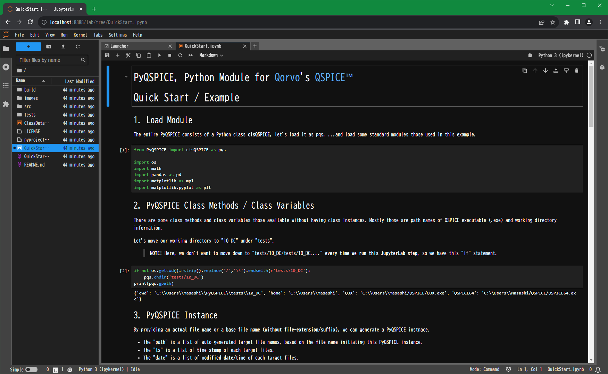

# Install:: PyQSPICE

## 1. [QSPICE™](https://www.qorvo.com/design-hub/design-tools/interactive/qspice)

First of all, we need the QSPICE simulator.
Click the link, download and install it on your Windows computer.

Link: [https://www.qorvo.com/design-hub/design-tools/interactive/qspice](https://www.qorvo.com/design-hub/design-tools/interactive/qspice)


## 2. [Python for Windows](https://www.python.org/downloads/windows/)

Because the QSPICE simulator works on a Windows PC, we assume to run your PyQSPICE code on Windows.
Download and install [Python for Windows](https://www.python.org/downloads/windows/).

Link: [https://www.python.org/downloads/windows/](https://www.python.org/downloads/windows/)

This PyQSPICE is developed on a version of Python below.

```console
bash >> python -V -V
Python 3.12.0 (tags/v3.12.0:0fb18b0, Oct  2 2023, 13:03:39) [MSC v.1935 64 bit (AMD64)]
```

## 3. PyQSPICE

The PyQSPICE is released through [GitHub](https://github.com) and [PyPI](https://pypi.org).

Below 2 modules are specified in PyQSPICE dependency.

* [matplotlib](https://matplotlib.org)
* [pandas](https://pandas.pydata.org)

> Note: matplotlib is not **must** to have when you plan only to do data processing, of NO plotting.
> The PyQSPICE examples in "tests* do use the matplotlib.


### 3.1 PyQSPICE from PyPI<a id='3.1'></a>

Link: [https://pypi.org/project/PyQSPICE/](https://pypi.org/project/PyQSPICE/)

```console
bash >> pip install PyQSPICE
Collecting PyQSPICE
  Obtaining dependency information for PyQSPICE from https://files.pythonhosted.org/packages/c5/17/1b02c61facfe579529961f0631606dd6c3c6528a930fad080e440e527c25/PyQSPICE-2023.10.10-py3-none-any.whl.metadata
  Using cached PyQSPICE-2023.10.10-py3-none-any.whl.metadata (19 kB)
Requirement already satisfied: pandas in c:\users\Masashi\Documents\venv_test\lib\site-packages (from PyQSPICE) (2.1.1)
Requirement already satisfied: matplotlib in c:\users\Masashi\Documents\venv_test\lib\site-packages (from PyQSPICE) (3.8.0)
Requirement already satisfied: contourpy>=1.0.1 in c:\users\Masashi\Documents\venv_test\lib\site-packages (from matplotlib->PyQSPICE) (1.1.1)
Requirement already satisfied: cycler>=0.10 in c:\users\Masashi\Documents\venv_test\lib\site-packages (from matplotlib->PyQSPICE) (0.12.1)
Requirement already satisfied: fonttools>=4.22.0 in c:\users\Masashi\Documents\venv_test\lib\site-packages (from matplotlib->PyQSPICE) (4.43.1)
Requirement already satisfied: kiwisolver>=1.0.1 in c:\users\Masashi\Documents\venv_test\lib\site-packages (from matplotlib->PyQSPICE) (1.4.5)
Requirement already satisfied: numpy<2,>=1.21 in c:\users\Masashi\Documents\venv_test\lib\site-packages (from matplotlib->PyQSPICE) (1.26.0)
Requirement already satisfied: packaging>=20.0 in c:\users\Masashi\Documents\venv_test\lib\site-packages (from matplotlib->PyQSPICE) (23.2)
Requirement already satisfied: pillow>=6.2.0 in c:\users\Masashi\Documents\venv_test\lib\site-packages (from matplotlib->PyQSPICE) (10.0.1)
Requirement already satisfied: pyparsing>=2.3.1 in c:\users\Masashi\Documents\venv_test\lib\site-packages (from matplotlib->PyQSPICE) (3.1.1)
Requirement already satisfied: python-dateutil>=2.7 in c:\users\Masashi\Documents\venv_test\lib\site-packages (from matplotlib->PyQSPICE) (2.8.2)
Requirement already satisfied: pytz>=2020.1 in c:\users\Masashi\Documents\venv_test\lib\site-packages (from pandas->PyQSPICE) (2023.3.post1)
Requirement already satisfied: tzdata>=2022.1 in c:\users\Masashi\Documents\venv_test\lib\site-packages (from pandas->PyQSPICE) (2023.3)
Requirement already satisfied: six>=1.5 in c:\users\Masashi\Documents\venv_test\lib\site-packages (from python-dateutil>=2.7->matplotlib->PyQSPICE) (1.16.0)
Using cached PyQSPICE-2023.10.10-py3-none-any.whl (16 kB)
Installing collected packages: PyQSPICE
Successfully installed PyQSPICE-2023.10.10
```

### 3.2 PyQSPICE from GitHub<a id='3.2'></a>

Link: [https://github.com/Qorvo/PyQSPICE](https://github.com/Qorvo/PyQSPICE)

```console
bash >> git clone https://github.com/Qorvo/PyQSPICE.git
Cloning into 'PyQSPICE'...
remote: Enumerating objects: 72, done.
remote: Counting objects: 100% (72/72), done.
remote: Compressing objects: 100% (46/46), done.
Receiving objects: 100% (72/72), 295.15 KiB | 8.43 MiB/s, done.0Receiving objects:  86% (62/72)

Resolving deltas: 100% (29/29), done.

bash >> cd PyQSPICE/

bash >> pip install .
Processing c:\users\Masashi\Documents\venv_test\pyqspice
  Installing build dependencies ... done
  Getting requirements to build wheel ... done
  Preparing metadata (pyproject.toml) ... done
Requirement already satisfied: pandas in c:\users\Masashi\Documents\venv_test\lib\site-packages (from PyQSPICE==2023.10.10) (2.1.1)
Requirement already satisfied: matplotlib in c:\users\Masashi\Documents\venv_test\lib\site-packages (from PyQSPICE==2023.10.10) (3.8.0)
Requirement already satisfied: contourpy>=1.0.1 in c:\users\Masashi\Documents\venv_test\lib\site-packages (from matplotlib->PyQSPICE==2023.10.10) (1.1.1)
Requirement already satisfied: cycler>=0.10 in c:\users\Masashi\Documents\venv_test\lib\site-packages (from matplotlib->PyQSPICE==2023.10.10) (0.12.1)
Requirement already satisfied: fonttools>=4.22.0 in c:\users\Masashi\Documents\venv_test\lib\site-packages (from matplotlib->PyQSPICE==2023.10.10) (4.43.1)
Requirement already satisfied: kiwisolver>=1.0.1 in c:\users\Masashi\Documents\venv_test\lib\site-packages (from matplotlib->PyQSPICE==2023.10.10) (1.4.5)
Requirement already satisfied: numpy<2,>=1.21 in c:\users\Masashi\Documents\venv_test\lib\site-packages (from matplotlib->PyQSPICE==2023.10.10) (1.26.0)
Requirement already satisfied: packaging>=20.0 in c:\users\Masashi\Documents\venv_test\lib\site-packages (from matplotlib->PyQSPICE==2023.10.10) (23.2)
Requirement already satisfied: pillow>=6.2.0 in c:\users\Masashi\Documents\venv_test\lib\site-packages (from matplotlib->PyQSPICE==2023.10.10) (10.0.1)
Requirement already satisfied: pyparsing>=2.3.1 in c:\users\Masashi\Documents\venv_test\lib\site-packages (from matplotlib->PyQSPICE==2023.10.10) (3.1.1)
Requirement already satisfied: python-dateutil>=2.7 in c:\users\Masashi\Documents\venv_test\lib\site-packages (from matplotlib->PyQSPICE==2023.10.10) (2.8.2)
Requirement already satisfied: pytz>=2020.1 in c:\users\Masashi\Documents\venv_test\lib\site-packages (from pandas->PyQSPICE==2023.10.10) (2023.3.post1)
Requirement already satisfied: tzdata>=2022.1 in c:\users\Masashi\Documents\venv_test\lib\site-packages (from pandas->PyQSPICE==2023.10.10) (2023.3)
Requirement already satisfied: six>=1.5 in c:\users\Masashi\Documents\venv_test\lib\site-packages (from python-dateutil>=2.7->matplotlib->PyQSPICE==2023.10.10) (1.16.0)
Building wheels for collected packages: PyQSPICE
  Building wheel for PyQSPICE (pyproject.toml) ... done
  Created wheel for PyQSPICE: filename=PyQSPICE-2023.10.10-py3-none-any.whl size=16181 sha256=d3ff90860df31c640a1f65de5b1376ed3f5789f3b5a714640ade31d8811f9144
  Stored in directory: C:\Users\Masashi\Db5a14ff3183fecd6dfc4d33cd9b9b239e3552a1372f1
Successfully built PyQSPICE
Installing collected packages: PyQSPICE
Successfully installed PyQSPICE-2023.10.10
```

## 5. Quick Testing

By this step, you can use the PyQSPICE on your python environment.

On the terminal, you start "python.exe".
```console
bash >> python
```

Then, in your Python interpreter, you check the PyQSPICE module installed.

```pycon
Python 3.12.0 (tags/v3.12.0:0fb18b0, Oct  2 2023, 13:03:39) [MSC v.1935 64 bit (AMD64)] on win32
Type "help", "copyright", "credits" or "license" for more information.
>>> from PyQSPICE import clsQSPICE as pqs
>>> pqs.gpath
{'cwd': 'C:\\Users\\Masashi\\Documents\\venv_test\\PyQSPICE', 'home': 'C:\\Users\\Masashi', 'QUX': 'C:\\Users\\Masashi/QSPICE/QUX.exe', 'QSPICE64': 'C:\\Users\\Masashi/QSPICE/QSPICE64.exe'}
>>> exit()
```

## 6. [JupyterLab](https://jupyter.org)

The PyQSPICE project on GitHub contains several examples based on the [JupyterLab](https://jupyter.org).
If not very familar with the Python, it's recommended to install the JupyterLab.

Link: [JupyterLab](https://jupyter.org)

> Note: Files on PyQSPICE are geranted and saved with "JupyterLab", NOT "Jupyter Notebook".

```console
bash >> pip install jupyterlab
Collecting jupyterlab
  Obtaining dependency information for jupyterlab from https://files.pythonhosted.org/packages/08/fa/b3c7d72df1f323483ae5107ad6036b9d06f677deff2aa51ac7e2b676720a/jupyterlab-4.0.7-py3-none-any.whl.metadata
  Using cached jupyterlab-4.0.7-py3-none-any.whl.metadata (15 kB)
Requirement already satisfied: async-lru>=1.0.0 in c:\users\Masashi\Documents\venv_test\lib\site-packages (from jupyterlab) (2.0.4)
Requirement already satisfied: ipykernel in c:\users\Masashi\Documents\venv_test\lib\site-packages (from jupyterlab) (6.25.2)
Requirement already satisfied: jinja2>=3.0.3 in c:\users\Masashi\Documents\venv_test\lib\site-packages (from jupyterlab) (3.1.2)
Requirement already satisfied: jupyter-core in c:\users\Masashi\Documents\venv_test\lib\site-packages (from jupyterlab) (5.4.0)
Requirement already satisfied: jupyter-lsp>=2.0.0 in c:\users\Masashi\Documents\venv_test\lib\site-packages (from jupyterlab) (2.2.0)
Requirement already satisfied: jupyter-server<3,>=2.4.0 in c:\users\Masashi\Documents\venv_test\lib\site-packages (from jupyterlab) (2.7.3)
Requirement already satisfied: jupyterlab-server<3,>=2.19.0 in c:\users\Masashi\Documents\venv_test\lib\site-packages (from jupyterlab) (2.25.0)
Requirement already satisfied: notebook-shim>=0.2 in c:\users\Masashi\Documents\venv_test\lib\site-packages (from jupyterlab) (0.2.3)
Requirement already satisfied: packaging in c:\users\Masashi\Documents\venv_test\lib\site-packages (from jupyterlab) (23.2)
Requirement already satisfied: tornado>=6.2.0 in c:\users\Masashi\Documents\venv_test\lib\site-packages (from jupyterlab) (6.3.3)
Requirement already satisfied: traitlets in c:\users\Masashi\Documents\venv_test\lib\site-packages (from jupyterlab) (5.11.2)
Requirement already satisfied: MarkupSafe>=2.0 in c:\users\Masashi\Documents\venv_test\lib\site-packages (from jinja2>=3.0.3->jupyterlab) (2.1.3)
Requirement already satisfied: anyio>=3.1.0 in c:\users\Masashi\Documents\venv_test\lib\site-packages (from jupyter-server<3,>=2.4.0->jupyterlab) (4.0.0)
Requirement already satisfied: argon2-cffi in c:\users\Masashi\Documents\venv_test\lib\site-packages (from jupyter-server<3,>=2.4.0->jupyterlab) (23.1.0)
Requirement already satisfied: jupyter-client>=7.4.4 in c:\users\Masashi\Documents\venv_test\lib\site-packages (from jupyter-server<3,>=2.4.0->jupyterlab) (8.4.0)
Requirement already satisfied: jupyter-events>=0.6.0 in c:\users\Masashi\Documents\venv_test\lib\site-packages (from jupyter-server<3,>=2.4.0->jupyterlab) (0.7.0)
Requirement already satisfied: jupyter-server-terminals in c:\users\Masashi\Documents\venv_test\lib\site-packages (from jupyter-server<3,>=2.4.0->jupyterlab) (0.4.4)
Requirement already satisfied: nbconvert>=6.4.4 in c:\users\Masashi\Documents\venv_test\lib\site-packages (from jupyter-server<3,>=2.4.0->jupyterlab) (7.9.2)
Requirement already satisfied: nbformat>=5.3.0 in c:\users\Masashi\Documents\venv_test\lib\site-packages (from jupyter-server<3,>=2.4.0->jupyterlab) (5.9.2)
Requirement already satisfied: overrides in c:\users\Masashi\Documents\venv_test\lib\site-packages (from jupyter-server<3,>=2.4.0->jupyterlab) (7.4.0)
Requirement already satisfied: prometheus-client in c:\users\Masashi\Documents\venv_test\lib\site-packages (from jupyter-server<3,>=2.4.0->jupyterlab) (0.17.1)
Requirement already satisfied: pywinpty in c:\users\Masashi\Documents\venv_test\lib\site-packages (from jupyter-server<3,>=2.4.0->jupyterlab) (2.0.12)
Requirement already satisfied: pyzmq>=24 in c:\users\Masashi\Documents\venv_test\lib\site-packages (from jupyter-server<3,>=2.4.0->jupyterlab) (25.1.1)
Requirement already satisfied: send2trash>=1.8.2 in c:\users\Masashi\Documents\venv_test\lib\site-packages (from jupyter-server<3,>=2.4.0->jupyterlab) (1.8.2)
Requirement already satisfied: terminado>=0.8.3 in c:\users\Masashi\Documents\venv_test\lib\site-packages (from jupyter-server<3,>=2.4.0->jupyterlab) (0.17.1)
Requirement already satisfied: websocket-client in c:\users\Masashi\Documents\venv_test\lib\site-packages (from jupyter-server<3,>=2.4.0->jupyterlab) (1.6.4)
Requirement already satisfied: platformdirs>=2.5 in c:\users\Masashi\Documents\venv_test\lib\site-packages (from jupyter-core->jupyterlab) (3.11.0)
Requirement already satisfied: pywin32>=300 in c:\users\Masashi\Documents\venv_test\lib\site-packages (from jupyter-core->jupyterlab) (306)
Requirement already satisfied: babel>=2.10 in c:\users\Masashi\Documents\venv_test\lib\site-packages (from jupyterlab-server<3,>=2.19.0->jupyterlab) (2.13.0)
Requirement already satisfied: json5>=0.9.0 in c:\users\Masashi\Documents\venv_test\lib\site-packages (from jupyterlab-server<3,>=2.19.0->jupyterlab) (0.9.14)
Requirement already satisfied: jsonschema>=4.18.0 in c:\users\Masashi\Documents\venv_test\lib\site-packages (from jupyterlab-server<3,>=2.19.0->jupyterlab) (4.19.1)
Requirement already satisfied: requests>=2.31 in c:\users\Masashi\Documents\venv_test\lib\site-packages (from jupyterlab-server<3,>=2.19.0->jupyterlab) (2.31.0)
Requirement already satisfied: comm>=0.1.1 in c:\users\Masashi\Documents\venv_test\lib\site-packages (from ipykernel->jupyterlab) (0.1.4)
Requirement already satisfied: debugpy>=1.6.5 in c:\users\Masashi\Documents\venv_test\lib\site-packages (from ipykernel->jupyterlab) (1.8.0)
Requirement already satisfied: ipython>=7.23.1 in c:\users\Masashi\Documents\venv_test\lib\site-packages (from ipykernel->jupyterlab) (8.16.1)
Requirement already satisfied: matplotlib-inline>=0.1 in c:\users\Masashi\Documents\venv_test\lib\site-packages (from ipykernel->jupyterlab) (0.1.6)
Requirement already satisfied: nest-asyncio in c:\users\Masashi\Documents\venv_test\lib\site-packages (from ipykernel->jupyterlab) (1.5.8)
Requirement already satisfied: psutil in c:\users\Masashi\Documents\venv_test\lib\site-packages (from ipykernel->jupyterlab) (5.9.5)
Requirement already satisfied: idna>=2.8 in c:\users\Masashi\Documents\venv_test\lib\site-packages (from anyio>=3.1.0->jupyter-server<3,>=2.4.0->jupyterlab) (3.4)
Requirement already satisfied: sniffio>=1.1 in c:\users\Masashi\Documents\venv_test\lib\site-packages (from anyio>=3.1.0->jupyter-server<3,>=2.4.0->jupyterlab) (1.3.0)
Requirement already satisfied: backcall in c:\users\Masashi\Documents\venv_test\lib\site-packages (from ipython>=7.23.1->ipykernel->jupyterlab) (0.2.0)
Requirement already satisfied: decorator in c:\users\Masashi\Documents\venv_test\lib\site-packages (from ipython>=7.23.1->ipykernel->jupyterlab) (5.1.1)
Requirement already satisfied: jedi>=0.16 in c:\users\Masashi\Documents\venv_test\lib\site-packages (from ipython>=7.23.1->ipykernel->jupyterlab) (0.19.1)
Requirement already satisfied: pickleshare in c:\users\Masashi\Documents\venv_test\lib\site-packages (from ipython>=7.23.1->ipykernel->jupyterlab) (0.7.5)
Requirement already satisfied: prompt-toolkit!=3.0.37,<3.1.0,>=3.0.30 in c:\users\Masashi\Documents\venv_test\lib\site-packages (from ipython>=7.23.1->ipykernel->jupyterlab) (3.0.39)
Requirement already satisfied: pygments>=2.4.0 in c:\users\Masashi\Documents\venv_test\lib\site-packages (from ipython>=7.23.1->ipykernel->jupyterlab) (2.16.1)
Requirement already satisfied: stack-data in c:\users\Masashi\Documents\venv_test\lib\site-packages (from ipython>=7.23.1->ipykernel->jupyterlab) (0.6.3)
Requirement already satisfied: colorama in c:\users\Masashi\Documents\venv_test\lib\site-packages (from ipython>=7.23.1->ipykernel->jupyterlab) (0.4.6)
Requirement already satisfied: attrs>=22.2.0 in c:\users\Masashi\Documents\venv_test\lib\site-packages (from jsonschema>=4.18.0->jupyterlab-server<3,>=2.19.0->jupyterlab) (23.1.0)
Requirement already satisfied: jsonschema-specifications>=2023.03.6 in c:\users\Masashi\Documents\venv_test\lib\site-packages (from jsonschema>=4.18.0->jupyterlab-server<3,>=2.19.0->jupyterlab) (2023.7.1)
Requirement already satisfied: referencing>=0.28.4 in c:\users\Masashi\Documents\venv_test\lib\site-packages (from jsonschema>=4.18.0->jupyterlab-server<3,>=2.19.0->jupyterlab) (0.30.2)
Requirement already satisfied: rpds-py>=0.7.1 in c:\users\Masashi\Documents\venv_test\lib\site-packages (from jsonschema>=4.18.0->jupyterlab-server<3,>=2.19.0->jupyterlab) (0.10.6)
Requirement already satisfied: python-dateutil>=2.8.2 in c:\users\Masashi\Documents\venv_test\lib\site-packages (from jupyter-client>=7.4.4->jupyter-server<3,>=2.4.0->jupyterlab) (2.8.2)
Requirement already satisfied: python-json-logger>=2.0.4 in c:\users\Masashi\Documents\venv_test\lib\site-packages (from jupyter-events>=0.6.0->jupyter-server<3,>=2.4.0->jupyterlab) (2.0.7)
Requirement already satisfied: pyyaml>=5.3 in c:\users\Masashi\Documents\venv_test\lib\site-packages (from jupyter-events>=0.6.0->jupyter-server<3,>=2.4.0->jupyterlab) (6.0.1)
Requirement already satisfied: rfc3339-validator in c:\users\Masashi\Documents\venv_test\lib\site-packages (from jupyter-events>=0.6.0->jupyter-server<3,>=2.4.0->jupyterlab) (0.1.4)
Requirement already satisfied: rfc3986-validator>=0.1.1 in c:\users\Masashi\Documents\venv_test\lib\site-packages (from jupyter-events>=0.6.0->jupyter-server<3,>=2.4.0->jupyterlab) (0.1.1)
Requirement already satisfied: beautifulsoup4 in c:\users\Masashi\Documents\venv_test\lib\site-packages (from nbconvert>=6.4.4->jupyter-server<3,>=2.4.0->jupyterlab) (4.12.2)
Requirement already satisfied: bleach!=5.0.0 in c:\users\Masashi\Documents\venv_test\lib\site-packages (from nbconvert>=6.4.4->jupyter-server<3,>=2.4.0->jupyterlab) (6.1.0)
Requirement already satisfied: defusedxml in c:\users\Masashi\Documents\venv_test\lib\site-packages (from nbconvert>=6.4.4->jupyter-server<3,>=2.4.0->jupyterlab) (0.7.1)
Requirement already satisfied: jupyterlab-pygments in c:\users\Masashi\Documents\venv_test\lib\site-packages (from nbconvert>=6.4.4->jupyter-server<3,>=2.4.0->jupyterlab) (0.2.2)
Requirement already satisfied: mistune<4,>=2.0.3 in c:\users\Masashi\Documents\venv_test\lib\site-packages (from nbconvert>=6.4.4->jupyter-server<3,>=2.4.0->jupyterlab) (3.0.2)
Requirement already satisfied: nbclient>=0.5.0 in c:\users\Masashi\Documents\venv_test\lib\site-packages (from nbconvert>=6.4.4->jupyter-server<3,>=2.4.0->jupyterlab) (0.8.0)
Requirement already satisfied: pandocfilters>=1.4.1 in c:\users\Masashi\Documents\venv_test\lib\site-packages (from nbconvert>=6.4.4->jupyter-server<3,>=2.4.0->jupyterlab) (1.5.0)
Requirement already satisfied: tinycss2 in c:\users\Masashi\Documents\venv_test\lib\site-packages (from nbconvert>=6.4.4->jupyter-server<3,>=2.4.0->jupyterlab) (1.2.1)
Requirement already satisfied: fastjsonschema in c:\users\Masashi\Documents\venv_test\lib\site-packages (from nbformat>=5.3.0->jupyter-server<3,>=2.4.0->jupyterlab) (2.18.1)
Requirement already satisfied: charset-normalizer<4,>=2 in c:\users\Masashi\Documents\venv_test\lib\site-packages (from requests>=2.31->jupyterlab-server<3,>=2.19.0->jupyterlab) (3.3.0)
Requirement already satisfied: urllib3<3,>=1.21.1 in c:\users\Masashi\Documents\venv_test\lib\site-packages (from requests>=2.31->jupyterlab-server<3,>=2.19.0->jupyterlab) (2.0.6)
Requirement already satisfied: certifi>=2017.4.17 in c:\users\Masashi\Documents\venv_test\lib\site-packages (from requests>=2.31->jupyterlab-server<3,>=2.19.0->jupyterlab) (2023.7.22)
Requirement already satisfied: argon2-cffi-bindings in c:\users\Masashi\Documents\venv_test\lib\site-packages (from argon2-cffi->jupyter-server<3,>=2.4.0->jupyterlab) (21.2.0)
Requirement already satisfied: six>=1.9.0 in c:\users\Masashi\Documents\venv_test\lib\site-packages (from bleach!=5.0.0->nbconvert>=6.4.4->jupyter-server<3,>=2.4.0->jupyterlab) (1.16.0)
Requirement already satisfied: webencodings in c:\users\Masashi\Documents\venv_test\lib\site-packages (from bleach!=5.0.0->nbconvert>=6.4.4->jupyter-server<3,>=2.4.0->jupyterlab) (0.5.1)
Requirement already satisfied: parso<0.9.0,>=0.8.3 in c:\users\Masashi\Documents\venv_test\lib\site-packages (from jedi>=0.16->ipython>=7.23.1->ipykernel->jupyterlab) (0.8.3)
Requirement already satisfied: fqdn in c:\users\Masashi\Documents\venv_test\lib\site-packages (from jsonschema>=4.18.0->jupyterlab-server<3,>=2.19.0->jupyterlab) (1.5.1)
Requirement already satisfied: isoduration in c:\users\Masashi\Documents\venv_test\lib\site-packages (from jsonschema>=4.18.0->jupyterlab-server<3,>=2.19.0->jupyterlab) (20.11.0)
Requirement already satisfied: jsonpointer>1.13 in c:\users\Masashi\Documents\venv_test\lib\site-packages (from jsonschema>=4.18.0->jupyterlab-server<3,>=2.19.0->jupyterlab) (2.4)
Requirement already satisfied: uri-template in c:\users\Masashi\Documents\venv_test\lib\site-packages (from jsonschema>=4.18.0->jupyterlab-server<3,>=2.19.0->jupyterlab) (1.3.0)
Requirement already satisfied: webcolors>=1.11 in c:\users\Masashi\Documents\venv_test\lib\site-packages (from jsonschema>=4.18.0->jupyterlab-server<3,>=2.19.0->jupyterlab) (1.13)
Requirement already satisfied: wcwidth in c:\users\Masashi\Documents\venv_test\lib\site-packages (from prompt-toolkit!=3.0.37,<3.1.0,>=3.0.30->ipython>=7.23.1->ipykernel->jupyterlab) (0.2.8)
Requirement already satisfied: cffi>=1.0.1 in c:\users\Masashi\Documents\venv_test\lib\site-packages (from argon2-cffi-bindings->argon2-cffi->jupyter-server<3,>=2.4.0->jupyterlab) (1.16.0)
Requirement already satisfied: soupsieve>1.2 in c:\users\Masashi\Documents\venv_test\lib\site-packages (from beautifulsoup4->nbconvert>=6.4.4->jupyter-server<3,>=2.4.0->jupyterlab) (2.5)
Requirement already satisfied: executing>=1.2.0 in c:\users\Masashi\Documents\venv_test\lib\site-packages (from stack-data->ipython>=7.23.1->ipykernel->jupyterlab) (2.0.0)
Requirement already satisfied: asttokens>=2.1.0 in c:\users\Masashi\Documents\venv_test\lib\site-packages (from stack-data->ipython>=7.23.1->ipykernel->jupyterlab) (2.4.0)
Requirement already satisfied: pure-eval in c:\users\Masashi\Documents\venv_test\lib\site-packages (from stack-data->ipython>=7.23.1->ipykernel->jupyterlab) (0.2.2)
Requirement already satisfied: pycparser in c:\users\Masashi\Documents\venv_test\lib\site-packages (from cffi>=1.0.1->argon2-cffi-bindings->argon2-cffi->jupyter-server<3,>=2.4.0->jupyterlab) (2.21)
Requirement already satisfied: arrow>=0.15.0 in c:\users\Masashi\Documents\venv_test\lib\site-packages (from isoduration->jsonschema>=4.18.0->jupyterlab-server<3,>=2.19.0->jupyterlab) (1.3.0)
Requirement already satisfied: types-python-dateutil>=2.8.10 in c:\users\Masashi\Documents\venv_test\lib\site-packages (from arrow>=0.15.0->isoduration->jsonschema>=4.18.0->jupyterlab-server<3,>=2.19.0->jupyterlab) (2.8.19.14)
Using cached jupyterlab-4.0.7-py3-none-any.whl (9.2 MB)
Installing collected packages: jupyterlab
Successfully installed jupyterlab-4.0.7
```

## 7. Clone the [PyQSPICE from GitHub](https://github.com/Qorvo/PyQSPICE)

So to use the saved JupyterLab example files on the PyQSPICE project, we clone (copy) the PyQSPICE from GitHub.

## 7.1 ...if you chose [3.2 PyQSPICE from GitHub](#3.2)

If you installed your PyQSPICE from the GitHub, you do nothing at this step.

## 7.2 ...if you chose [3.1 PyQSPICE from PyPI](#3.1)

Please clone the PyQSPICE.

```console
bash >> git clone https://github.com/Qorvo/PyQSPICE.git
Cloning into 'PyQSPICE'...
remote: Enumerating objects: 72, done.
remote: Counting objects: 100% (72/72), done.
remote: Compressing objects: 100% (46/46), done.
Receiving objects: 100% (72/72), 295.15 KiB | 8.43 MiB/s, done.0Receiving objects:  86% (62/72)

Resolving deltas: 100% (29/29), done.

bash >> cd PyQSPICE/
```

## 8. Final Testing

Now, you can use PyQSPICE on JupyterLab and you can open the examples from the PyQSPICE project.

```console
bash >> jupyter lab
```

With the command "jupyter lab", you will have this window or tab on your browser.


Then, please start with the QuickStart.jpynb by double-clicking it on the left pane.



## 9. Continue to [QuickStart](QuickStart.md)

Now you finish installing your PyQSPICE environment and please move to the [QuickStart](QuickStart.md).

