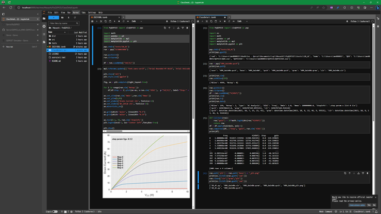

# PyQSPICE

***

***

## About PyQSPICE and QSPICE

The PyQSPICE is a Python package / class of wrapper script interface for the [QSPICE™](https://www.qorvo.com/design-hub/design-tools/interactive/qspice) - a SPICE circuit simulator - available from [Qorvo](https://www.qorvo.com) at no cost.

The PyQSPICE invokes QSPICE executable files in a CUI (Charactor User Interface) manner.

* PyQSPICE executes simulations.
* PyQSPICE loads simulation results into Python memory for plotting.
* PyQSPICE expects QSPICE schematic (.qsch) or netlist (.cir) files prepared by users.
    * Using QSPICE GUI to capture schematics
    * Generate netlist files manually or programming manner

***

## License and Availability

The PyQSPICE is under the [Qorvo software license](https://github.com/Qorvo/PyQSPICE/blob/13ae6387ef4619cf605c854739218b3d24db69d2/LICENSE),

and PyQSPICE is available from two (2) repositories at the [Qorvo@GitHub](https://github.com/Qorvo) and the [PyPI](https://pypi.org) 
* GitHub:  [https://github.com/Qorvo/PyQSPICE](https://github.com/Qorvo/PyQSPICE)
* PyPI:  [https://pypi.org/project/PyQSPICE](https://pypi.org/project/PyQSPICE)

