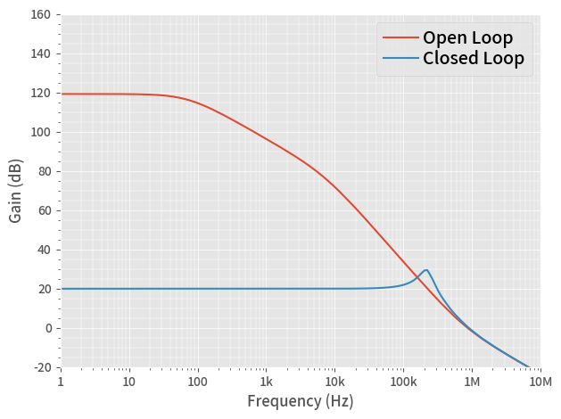

# AC Simulation Example

In this example, we run a **AC** simulation of an ideal LDO model.

This is the same code saved in the **20_AC.py**, with more interactive descriptions.

## 1. Run a Simulation

After running below block of code, we have the simulation result in a Pandas DataFrame **df**.


```python
from PyQSPICE import clsQSPICE as pqs

import re
import math
import pandas as pd
import matplotlib as mpl
import matplotlib.pyplot as plt

fname = "VRM_GainBW"

run = pqs(fname)

run.InitPlot()

run.qsch2cir()
run.cir2qraw()

run.setNline(199)

df = run.LoadQRAW(["V(vout)"])

df = run.GainPhase(df, "V(vout)", "gain", "phase")

# Bring back some data "real"
run.comp2real(df, ["Step", "gain", run.sim['Xlbl']])

print(df)
```

                 Freq                       V(vout)  Step        gain  \
    0    1.000000e+00  911837.335958- 11388.964345j   0.0  119.199025   
    1    1.096986e+00  911798.215591- 12736.912744j   0.0  119.198822   
    2    1.203378e+00  911752.322222- 14195.455127j   0.0  119.198590   
    3    1.320088e+00  911698.242840- 15776.598004j   0.0  119.198323   
    4    1.448118e+00  911634.327084- 17493.466022j   0.0  119.198012   
    ..            ...                           ...   ...         ...   
    395  6.905514e+07      -0.000091-     0.009586j   1.0  -40.367113   
    396  7.575250e+07      -0.000076-     0.008746j   1.0  -41.163222   
    397  8.309942e+07      -0.000063-     0.007972j   1.0  -41.968396   
    398  9.115888e+07      -0.000052-     0.007259j   1.0  -42.782042   
    399  1.000000e+08      -0.000043-     0.006604j   1.0  -43.603625   
    
                        phase  
    0    -0.715594+ 0.000000j  
    1    -0.800313+ 0.000000j  
    2    -0.891990+ 0.000000j  
    3    -0.991383+ 0.000000j  
    4    -1.099321+ 0.000000j  
    ..                    ...  
    395 -90.541948+ 0.000000j  
    396 -90.494899+ 0.000000j  
    397 -90.450972+ 0.000000j  
    398 -90.410180+ 0.000000j  
    399 -90.372467+ 0.000000j  
    
    [400 rows x 5 columns]
    

Note that the gain calculation of "df = df.apply()" makes everything "complex".  So we re-convert known "non-complex" data to "real".

## 2. Plotting


```python
# Prepare a blank plotting area
fig, ax = plt.subplots(tight_layout=True)

# Plot AC curves of all ".STEP" (we know only 2 steps)
df[df.Step == 0].plot(ax=ax, x="Freq",  y="gain", label="Open Loop")
df[df.Step == 1].plot(ax=ax, x="Freq",  y="gain", label="Closed Loop")

run.PrepFreqGainPlot(ax, "Frequency (Hz)", "Gain (dB)", [1,10e6], [-20,160])

# Save the Plot in PNG file
plt.savefig(run.path['base'] + "_plt.png", format='png', bbox_inches='tight')
plt.show()

plt.close('all')
```


    

    

